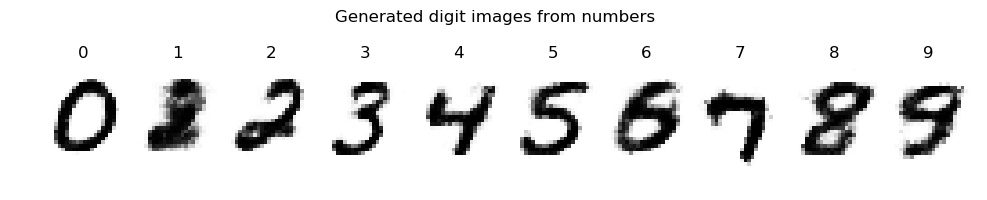

## Simple tutotial code for Deep Belief Network (DBN)

The python code implements DBN with an example of MNIST digits image reconstruction.

It also includes a classifier based on the BDN, i.e., the visible units of the top layer include not only the input but also the labels. Then the top layer RBM learns the distribution of p(v, label, h). The input v is still provided from the bottom of the network. The classification is to find the distribution of p(label|v). With the simple implementation, the classifier achieved 92% accuracy without tuning after trained with MNIST for 100 epochs. 

The classifier code comes with a digit generator that generates digit images from labels. It is the reverse process of the classifier, i.e., find the distribution of p(v|label). The label is provided to the top layer RBM as part of its visible units, and the image is output at the bottom of the network. The generated images are not pretty while roughly eligible as given below.

